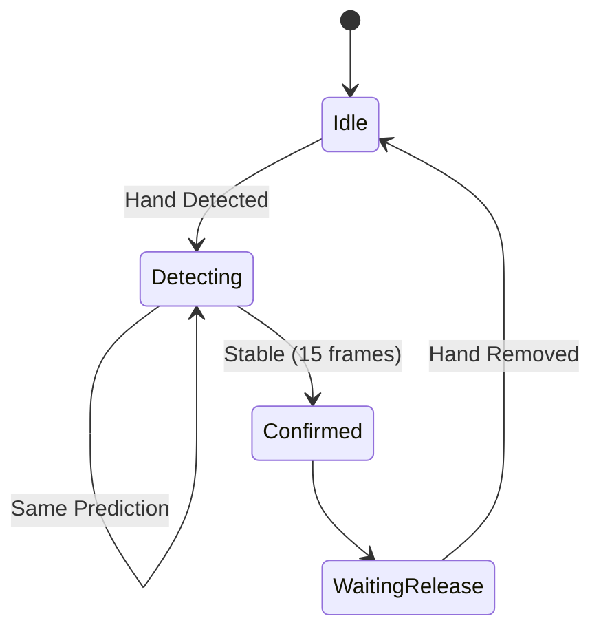
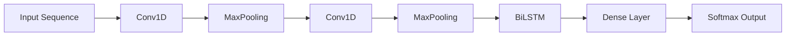
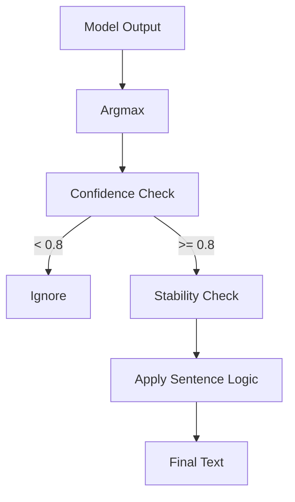

# 🤟 AI Sign Language Translator (Arabic & English)

A real-time **AI-powered Sign Language Translator** that converts hand gestures into text (and speech) using **Deep Learning (CNN-LSTM)** and **MediaPipe**.

Supports both **Arabic 🇸🇦 and English 🇬🇧** and is ready for **mobile deployment using TensorFlow Lite**.

---

## 🚀 Features

* 🔤 Real-time sign recognition
* 🌍 Arabic & English support
* 🧠 CNN + BiLSTM model
* ✋ MediaPipe hand tracking
* 🧾 Smart sentence building (`space`, `del`, repeat handling)
* 🔊 Text-to-Speech (Arabic + English)
* 📱 Mobile-ready (TFLite)

---

# 🧠 System Architecture

```mermaid
flowchart TD
    A[Camera Input] --> B[MediaPipe Hands]
    B --> C[21 Landmarks Extraction]
    C --> D[Flatten to 63 Features]
    D --> E[Sequence Builder (23 Frames)]
    E --> F[CNN + BiLSTM Model]
    F --> G[Prediction]
    G --> H[Postprocessing Logic]
    H --> I[Sentence Builder]
    I --> J[Text Output]
    I --> K[Speech Output]
```

---

# 🧩 Detailed Pipeline

```mermaid
flowchart LR
    A[Frame] --> B[Flip Image]
    B --> C[Hand Detection]
    C --> D[Landmarks (21 x 3)]
    D --> E[Normalization]
    E --> F[Sequence Buffer]
    F --> G[Model Inference]
    G --> H[Confidence Check]
    H --> I[Stability Logic]
    I --> J[Final Letter]
```

---

# 🔄 Stability & Prediction Logic



---

# 🧠 Model Details

### Input

* 21 landmarks × (x, y, z)
* 63 features
* 23 timesteps
* Shape: `(1, 23, 63)`

### Architecture



---

# 📊 Models

| Model   | Classes |
| ------- | ------- |
| Arabic  | 33      |
| English | 28      |

---

# ⚙️ Preprocessing

```mermaid
flowchart TD
    A[Capture Frame] --> B[Flip Frame]
    B --> C[Detect Hand]
    C --> D[Extract Landmarks]
    D --> E[Flatten (63)]
    E --> F[Mirror if Right Hand]
    F --> G[Repeat to 23 Frames]
    G --> H[Normalize]
```

---

# 🧾 Postprocessing



---

# 📦 Project Structure

```text
Sign-Language-Translator/
│
├── src/
├── models/
├── metadata/
├── assets/
├── README.md
├── requirements.txt
└── .gitignore
```

---

# ▶️ Run the Project

```bash
pip install -r requirements.txt
```

```bash
python src/english_test.py
```

```bash
python src/arabic_test.py
```

---

# 📱 Mobile Deployment

```text
models/
├── arsl_model.tflite
└── asl_model.tflite
```

⚠️ Requires:
**TensorFlow Lite Flex Delegate**

---

# 🛠️ Tech Stack

* TensorFlow / Keras
* MediaPipe
* OpenCV
* NumPy
* gTTS
* pygame
* Flutter

---

# 🎯 Challenges Solved

* Temporal gesture modeling (LSTM)
* Prediction noise reduction
* Arabic RTL rendering
* Mobile model deployment

---

# 🚀 Future Work

* Word-level recognition
* Offline Arabic TTS
* Faster model (no LSTM)
* Full mobile pipeline

---

# 👨‍💻 Author

Ahmed Sobhy
Aspiring AI Engineer
